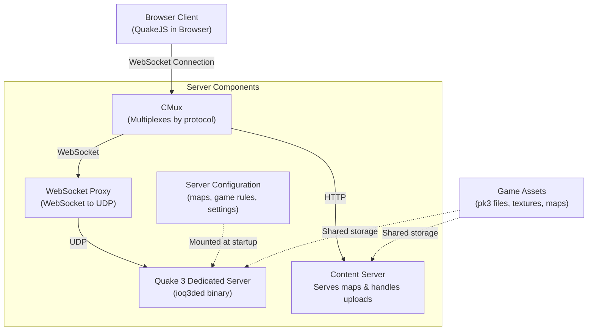

# QuakeKube

> Originally forked from [criticalstack/quake-kube](https://github.com/criticalstack/quake-kube)

[](https://opensource.org/licenses/Apache-2.0)

QuakeKube is a Kubernetes-ified version of [QuakeJS](https://github.com/inolen/quakejs) that runs a dedicated [Quake 3](https://en.wikipedia.org/wiki/Quake_III_Arena) server in a Kubernetes Deployment, and then allow clients to connect via QuakeJS in the browser.

## Prerequisites

- Kubernetes cluster (v1.19+)
- kubectl configured to communicate with your cluster
- (Optional) [kind](https://kind.sigs.k8s.io/) for local development

## Quick start

### With an existing K8s cluster

Deploy the example manifest:

```shell
kubectl apply -f https://raw.githubusercontent.com/grahamplata/quake-kube/gplata/init/example.yaml
```

### Without an existing K8s cluster

Start an instance of Kubernetes locally using [kind](https://kind.sigs.k8s.io/):

```shell
kind create cluster
```

Deploy the example manifest:

```shell
kubectl apply -f example.yaml
```

Finally, navigate to `http://localhost:30001` in the browser.

### Using Helm

Add the Helm repository:

```shell
helm repo add quake-kube https://grahamplata.github.io/quake-kube
helm repo update
```

Install the chart:

```shell
helm install quake-kube quake-kube/quake-kube --set quake.agreeEula=true
```

Access the game at `http://<NODE_IP>:30001`.

For customization options, see [helm/quake-kube/values.yaml](helm/quake-kube/values.yaml).


## QuakeKube Operator

For a more robust and scalable deployment, you can use the **QuakeKube Operator**. The operator provides a declarative way to manage multiple Quake 3 servers using Kubernetes Custom Resources.

**Key Features:**
- **Declarative Management**: Define servers as `QuakeServer` resources.
- **Reusable Templates**: Share configurations across servers using `QuakeServerTemplate`.
- **Gateway API Support**: Native integration for exposing servers.
- **Validation**: Webhooks ensure your configuration is correct.

To install the operator via Helm:

```shell
helm install quake-operator ./helm/quake-kube-operator -n quake-system --create-namespace
```

For full documentation on the operator, including CRD examples and advanced configuration, see the [Operator README](operator/README.md).

## How it works

QuakeKube makes use of [ioquake](https://www.ioquake3.org) for the Quake 3 dedicated server, and [QuakeJS](https://github.com/inolen/quakejs), a port of ioquake to javascript using [Emscripten](http://github.com/kripken/emscripten), to provide an in-browser game client.

### Architecture



### Networking

The client/server protocol of Quake 3 uses UDP to synchronize game state. Browsers do not natively support sending UDP packets so QuakeJS wraps the client and dedicated server net code in websockets, allowing the browser-based clients to send messages and enable multiplayer for other clients. This ends up preventing the browser client from using any other Quake 3 dedicated server. In order to use other Quake 3 dedicated servers, a proxy handles websocket traffic coming from browser clients and translates that into UDP to the backend. This gives the flexibility of being able to talk to other existing Quake 3 servers, but also allows using ioquake (instead of the javascript translation of it), which uses *considerably* less CPU and memory.

QuakeKube also uses a cool trick with [cmux](https://github.com/cockroachdb/cmux) to multiplex the client and websocket traffic into the same connection. Having all the traffic go through the same address makes routing a client to its backend much easier (since it can just use its `document.location.host`).

### Quake 3 demo EULA

The Quake 3 dedicated server requires an End-User License Agreement be agreed to by the user before distributing the Quake 3 demo files that are used (maps, textures, etc). To ensure that the installer is aware of, and agrees to, this EULA, the flag `--agree-eula` must be passed to `q3 server` at runtime. This flag is not set by default in the container image and is therefore required for the dedicated server to pass the prompt for EULA. The [example.yaml](example.yaml) manifest demonstrates usage of this flag to agree to the EULA.

## Configuration

The server and maps are configured via ConfigMap that is mounted to the container:

```yaml
apiVersion: v1
kind: ConfigMap
metadata:
  name: quake3-server-config
data:
  config.yaml: |
    fragLimit: 25
    timeLimit: 15m
    game:
      motd: "Welcome to Quake Kube"
      type: FreeForAll
      forceRespawn: false
      inactivity: 10m
      quadFactor: 3
      weaponRespawn: 3
    server:
      hostname: "quakekube"
      maxClients: 12
      password: "changeme"
    maps:
    - name: q3dm7
      type: FreeForAll
    - name: q3dm17
      type: FreeForAll
    - name: q3wctf1
      type: CaptureTheFlag
      captureLimit: 8
    - name: q3tourney2
      type: Tournament
    - name: q3wctf3
      type: CaptureTheFlag
      captureLimit: 8
    - name: ztn3tourney1
      type: Tournament
```

The time limit and frag limit can be specified with each map (it will change it for subsequent maps in the list):

```yaml
- name: q3dm17
  type: FreeForAll
  fragLimit: 30
  timeLimit: 30
```

Capture limit for CTF maps can also be configured:

```yaml
- name: q3wctf3
  type: CaptureTheFlag
  captureLimit: 8
```

Any commands not captured by the config yaml can be specified in the `commands` section:

```yaml
commands:
- seta g_inactivity 600
- seta sv_timeout 120
```

### Add bots

Bots can be added individually to map rotations using the `commands` section of the config:

```yaml
commands:
  - addbot crash 1
  - addbot sarge 2
```

The `addbot` server command requires the name of the bot and skill level (crash and sarge are a couple of the built-in bots).

Another way to add bots is by setting a minimum number of players to allow the server to add bots up to a certain value (removed when human players join):

```yaml
bot:
  minPlayers: 8
game:
  singlePlayerSkill: 2
```

`singlePlayerSkill` can be used to set the skill level of the automatically added bots (2 is the default skill level).

### Setting a password

A password should be set for the server to allow remote administration and is found in the server configuration settings:

```yaml
server:
  password: "changeme"
```

This will allow clients to use `\rcon changeme <cmd>` to remotely administrate the server. To create a password that must be provided by clients to connect:

```yaml
game:
  password: "letmein"
```

This will add an additional dialog to the in-browser client to accept the password. It will only appear if the server indicates it needs a password.

### Add custom maps

The content server hosts a small upload app to allow uploading `pk3` or `zip` files containing maps. The content server in the [example.yaml](example.yaml) shares a volume with the game server, effectively "side-loading" the map content, however, in the future the game server will introspect into the maps and make sure that it can fulfill the users map configuration before starting.

## Development

The easiest way to develop quake-kube is building the binary locally with `make` and running it directly. This only requires that you have the `ioq3ded` binary in your path:

```shell
bin/q3 server -c config.yaml --assets-dir $HOME/.q3a --agree-eula
```

### Project Structure

```
quake-kube/
├── cli/              # CLI tool implementation
├── internal/quake/   # Core game server logic
├── pkg/              # Reusable packages (q3, content server)
├── public/           # QuakeJS client assets
├── tools/            # Build and development tools
├── config.yaml       # Default server configuration
├── example.yaml      # Kubernetes deployment manifest
└── Dockerfile        # Multi-platform container image
```

### Multi-platform images

Container images are being cross-compiled with [Docker Buildx](https://docs.docker.com/buildx/working-with-buildx/) so it can run on hardware with different architectures and operating systems. Currently, it is building for `linux/amd64` and `linux/arm64`. While not specifically compiling to the macOS platform (`darwin/amd64`) QuakeKube should also work on macOS and maybe even Windows. This is due to the fact that they both use a linux VM to provide container support.

Docker Buildx uses [QEMU](https://www.qemu.org/) to virtualize non-native platforms, which has unfortunately had long-running issues running the Go compiler:

- [golang/go#24656](https://github.com/golang/go/issues/24656)
- [https://bugs.launchpad.net/qemu/+bug/1696773](https://bugs.launchpad.net/qemu/+bug/1696773)

This issue is circumvented by ensuring that the Go compiler does not run across multiple hardware threads, which is why the affinity is being limited in the Dockerfile.

## Troubleshooting

### Port Already in Use

If port 30001 is already in use, you can modify the NodePort in `example.yaml` to use a different port.

### Browser Can't Connect

- Verify the pods are running: `kubectl get pods -l app=quakekube`
- Check service status: `kubectl get svc quake-kube`
- For kind clusters, ensure port mapping is configured: `kind create cluster --config kind-config.yaml`
- Check the service logs: `kubectl logs -l app=quakekube`

### Game Server Not Starting

- Verify the `--agree-eula` flag is set in the deployment
- Check the server configuration in the ConfigMap
- Ensure the game assets volume is properly mounted

## Contributing

Contributions are welcome! Please feel free to submit a Pull Request.

1. Fork the repository
2. Create your feature branch (`git checkout -b feature/amazing-feature`)
3. Commit your changes (`git commit -m 'Add some amazing feature'`)
4. Push to the branch (`git push origin feature/amazing-feature`)
5. Open a Pull Request

## Credits

- [criticalstack/quake-kube](https://github.com/criticalstack/quake-kube) - The original QuakeKube project that this fork is based on.
- [inolen/quakejs](https://github.com/inolen/quakejs) - The really awesome QuakeJS project that makes this possible.
- [ioquake/ioq3](https://github.com/ioquake/ioq3) - The community supported version of Quake 3 used by QuakeJS. It is licensed under the GPLv2.
- [begleysm/quakejs](https://github.com/begleysm/quakejs) - Information in the README.md (very helpful) was used as a guide, as well as, some forked assets of this project (which came from quakejs-web originally) were used.
- [joz3d.net](http://www.joz3d.net/html/q3console.html) - Useful information about configuration values.

## License

This project is licensed under the Apache License 2.0 - see the [LICENSE](LICENSE) file for details.
